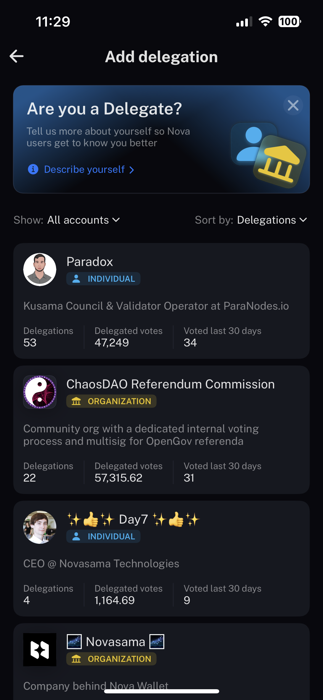
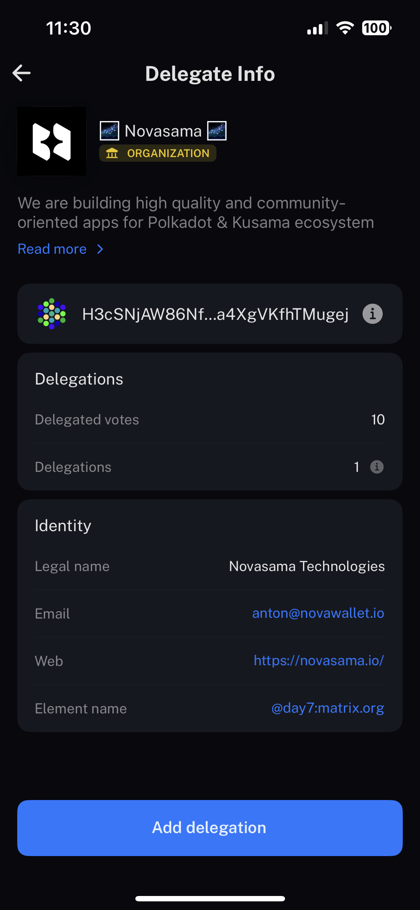
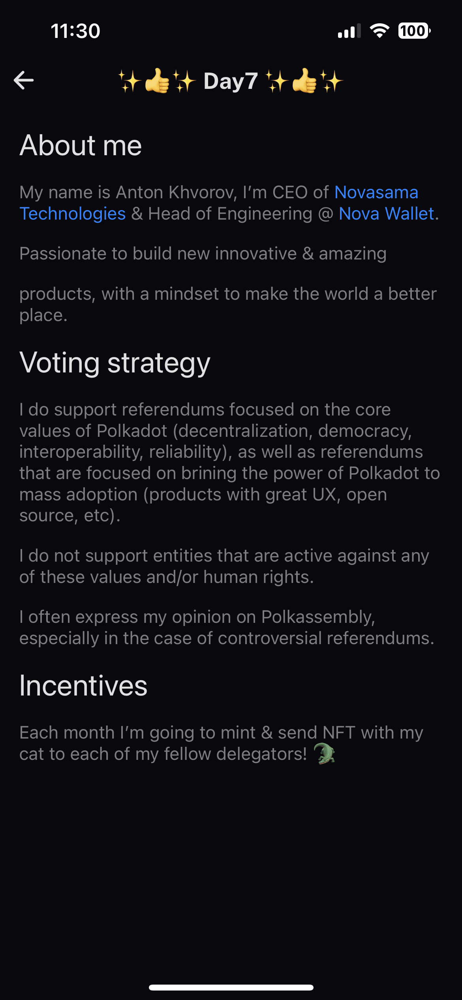

# Welcome to the Delegate Registry!

In this repository, we aim to create a comprehensive directory for individuals and organizations in the [Substrate](https://substrate.io) ecosystem to share their delegator information in [Nova Wallet](https://novawallet.io/)'s agile delegation interface. 

## How it looks like

Here are a few examples of how your information could be displayed in the directory:

</br>
<details>
  <summary>Nova Wallet app screens</summary>





</details>
</br>

Note: These are just examples, and your actual format may vary.


## Sharing your information

To share your information, please create a JSON file with the following format:

```javascript
{
    "address": string, //substrate address in ss58 format
    "name": string, // Your title / display name which will appear in the list
    "image": string, // link to your relevant image (such as your profile picture),
    "shortDescription": string, // a brief description, no more than 256 characters long,
    "longDescription": string, // a long description that can be more than 256 characters in length, supports markdown syntax,
    "isOrganization": bool
}
```


- `address`: Your Substrate address in [ss58 format](https://substrate.dev/docs/en/learn/address-format).
- `name`: Your name or the name of your organization (display name).
- `image`: A link to an image that represents you or your organization. It should be in `.png` format and should be stored in [this repo](./images)
- `shortDescription`: A short description of yourself or your organization (no more than 256 characters).
- `longDescription`: A more detailed description of yourself or your organization, which can include markdown syntax for formatting.
- `isOrganization`: A boolean value indicating whether you are an individual or an organization.

## Pull requests
> [!IMPORTANT]  
> Due to migration from Polkadot/Kusama relay networks we accept PRs to Polkadot/Kusama Asset Hub networks respectively.

Please submit your information as a pull request to this repository. We will review your submission and add it to the directory once approved.
[Tutorial](https://docs.novawallet.io/nova-wallet-wiki/governance/add-delegate-information) are available in our wiki.

## Directory

A list of networks with information about individuals and organizations in the Substrate ecosystem can be found [here](./registry). Networks are divided into separate files, make sure you choose the right one.

## License
Delegate Registry is available under the Apache 2.0 license. See the LICENSE file for more info.
© Novasama Technologies GmbH 2023